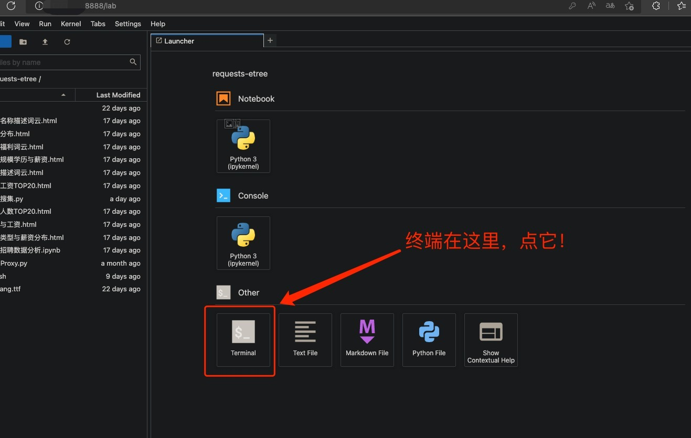
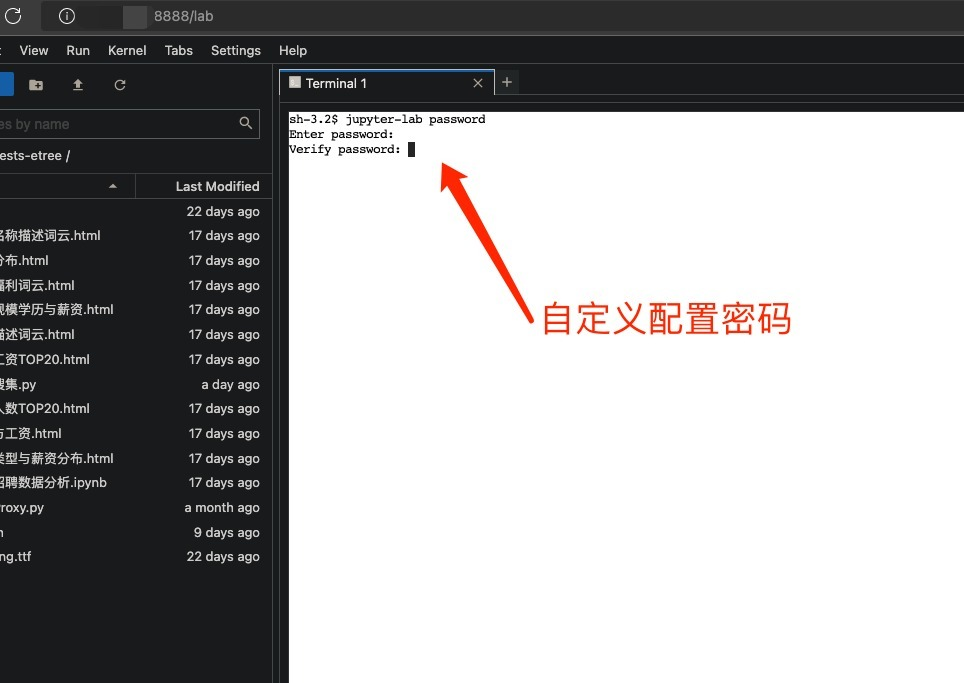

# docker-arch-miniforge-jupyter
在 arm64v8 和 amd64 alpine 上使用的 miniforge Jupyter docker构建材料，alpine 支持 glibc 2.40

    
<a href="https://star-history.com/#UiLgNoD-lIaMtOh/docker-arch-miniforge-jupyter&Date">
  <picture>
    <source media="(prefers-color-scheme: dark)" srcset="https://api.star-history.com/svg?repos=UiLgNoD-lIaMtOh/docker-arch-miniforge-jupyter&type=Date&theme=dark" />
    <source media="(prefers-color-scheme: light)" srcset="https://api.star-history.com/svg?repos=UiLgNoD-lIaMtOh/docker-arch-miniforge-jupyter&type=Date" />
    
  </picture>
</a>

## ghcr.io
镜像仓库链接：[https://github.com/UiLgNoD-lIaMtOh/docker-arch-miniforge-jupyter/pkgs/container/alpine-miniforge-jupyter](https://github.com/UiLgNoD-lIaMtOh/docker-arch-miniforge-jupyter/pkgs/container/alpine-miniforge-jupyter)  

## 描述
1.为了实现 actions workflow 自动化 docker 构建运行，需要添加 `GITHUB_TOKEN` 环境变量，这个是访问 GitHub API 的令牌，可以在 GitHub 主页，点击个人头像，Settings -> Developer settings -> Personal access tokens -> Tokens (classic) -> Generate new token -> Generate new token (classic) ，设置名字为 GITHUB_TOKEN 接着要配置 环境变量有效时间，勾选环境变量作用域 repo write:packages workflow 和 admin:repo_hook 即可，最后点击Generate token，如图所示

  

2.赋予 actions[bot] 读/写仓库权限，在仓库中点击 Settings -> Actions -> General -> Workflow Permissions -> Read and write permissions -> save，如图所示

3.转到 Actions  

    -> Clean Git Large Files 并且启动 workflow，实现自动化清理 .git 目录大文件记录  
    -> Docker Image Build and Deploy Images to GHCR CI 并且启动 workflow，实现自动化构建镜像并推送云端  
    -> Remove Old Workflow Runs 并且启动 workflow，实现自动化清理 workflow 并保留最后三个    
    
4.这是包含了 miniforge 和 jupyter 的 docker 构建材料  
5.主要目的是为了使用 jupyter 本来没想这么复杂，我就是觉得 miniforge 好，为了自己的追求，只能辛苦一下  
6.以下是思路：    
  * 先构建适配 Alpine 的 glibc apk 包，并在 Alpine 镜像中安装
  * 安装 miniforge 环境并安装 jupyter 然后维持其运行，这样容器就不会自己停止，实在太慢，我都哭了 >_<  

7.目录结构：  

      .                                                       
      ├── Dockerfile                                         # 这个是 构建 miniforge+jupyter 的 Dockerfile 配置文件  
      ├── README.md                                          # 这个是 描述 文件  
      ├── docker-compose-amd64.yml                           # 这个是构建 miniforge+jupyter amd64 的 docker-compose.yml 配置文件  
      ├── docker-compose-arm64.yml                           # 这个是构建 miniforge+jupyter arm64 的 docker-compose.yml 配置文件  
      ├── package                                            # 这个是构建 miniforge+jupyter 的脚本文件材料所在目录   
      │   ├── init.sh                                        # 这个是初始化 bash shell 环境脚本文件  
      │   ├── install.sh                                     # 这个是构建 miniforge+jupyter 镜像的时候在容器内执行流程的脚本   
      │   ├── requirements.txt                               # 这个是 python 安装依赖库文件  
      │   └── run_jupyter                                    # 这个是启动 jupyter 的脚本无密码环境，第一次执行初始密码123456    
      └── arch_switch.sh                                     # 这个是 actions 所需要的切换脚本用于切换 aarch64 和 x86_64 架构编译  

## 构建命令
### 构建
    # clone 项目
    git clone https://github.com/UiLgNoD-lIaMtOh/docker-arch-miniforge-jupyter
    
    # 进入目录
    cd docker-arch-miniforge-jupyter/
    
    # 无缓存构建
    ## arm64
    docker build --no-cache --platform "linux/arm64/v8" -f Dockerfile -t ghcr.io/uilgnod-liamtoh/docker-arch-miniforge-jupyter:latest . ; docker builder prune -fa ; docker rmi $(docker images -qaf dangling=true)  
    ## amd64
    docker build --no-cache --platform "linux/amd64" -f Dockerfile -t ghcr.io/uilgnod-liamtoh/docker-arch-miniforge-jupyter:latest . ; docker builder prune -fa ; docker rmi $(docker images -qaf dangling=true)  
    # 或者这么构建也可以二选一
    ## arm64
    docker-compose -f docker-compose-arm64.yml build --no-cache ; docker builder prune -fa ; docker rmi $(docker images -qaf dangling=true)
    ## amd64
    docker-compose -f docker-compose-amd64.yml build --no-cache ; docker builder prune -fa ; docker rmi $(docker images -qaf dangling=true)
    
    # 构建完成后修改 docker-compose.yml 后启动享用，默认密码 123456
    # 初始密码修改环境变量字段 PASSWORD 详细请看 docker-compose.yml
    # 端口默认 8888
    ## arm64
    docker-compose -f docker-compose-arm64.yml up -d --force-recreate
    ## amd64
    docker-compose -f docker-compose-amd64.yml up -d --force-recreate
    # 也可以查看日志看看有没有问题 ,如果失败了就再重新尝试看看只要最后不报错就好 
    ## arm64
    docker-compose -f docker-compose-arm64.yml logs -f
    ## amd64
    docker-compose -f docker-compose-amd64.yml logs -f

## 默认密码以及修改
    # 别担心我料到这一点了，毕竟我自己还要用呢
    # 首先访问 http://[主机IP]:8888 输入默认密码 123456
    # 然后如图打开终端 在终端内执行密码修改指令 需输入两次 密码不会显示属于正常现象 密码配置文件会保存到容器内的 $HOME/.jupyter/jupyter_server_config.json 
    jupyter-lab password
  
  

# 核心依赖，关于支持 arch_switch.sh alpine glibc 编译包
## 编译 alpine arm64v8 的 glibc 包流程
    # 参考: https://gist.github.com/ljfranklin/f6a7dfcfb2c573d4a276dad59e58db82
    # 设备 CPU 架构 arm64v8 
    # 系统环境 ubuntu
    # MAINTAINER UiLgNoD-lIaMtOh <UiLgNoD.lIaMtOh@hotmail.com>
    # clone sgerrand/docker-glibc-builder 借用 ubuntu 编译 glibc
    git clone "https://github.com/sgerrand/docker-glibc-builder"
      
    # 检查最新版本 glibc 源码 https://mirrors.kernel.org/gnu/libc/ 为 2.40 版本的 tar.gz
    cd docker-glibc-builder

    # 修改 Dockerfile 
    # 参考: https://askubuntu.com/questions/804997/dpkg-error-processing-package-libc-bin-configure
        cat <<'UiLgNoD-lIaMtOh' | tee Dockerfile
    FROM ubuntu:22.04
    LABEL MAINTAINER="UiLgNoD-lIaMtOh <UiLgNoD.lIaMtOh@hotmail.com>"
    ENV DEBIAN_FRONTEND=noninteractive \
        GLIBC_VERSION=2.40 \
        PREFIX_DIR=/usr/glibc-compat
    RUN mkdir -pv /glibc-build/ && apt-get -q update \
            && apt-get -qy install \
                    bison \
                    build-essential \
                    gawk \
                    gettext \
                    openssl \
                    python3 \
                    texinfo \
                    wget \
            ; mv -fv /var/lib/dpkg/info/libc-bin.* /tmp/ \
            ; dpkg --remove --force-remove-reinstreq libc-bin \
            ; dpkg --purge libc-bin \
            ; apt-get -qy install libc-bin \
            ; mv -fv /tmp/libc-bin.* /var/lib/dpkg/info/
    COPY configparams /glibc-build/configparams
    COPY builder /builder
    ENTRYPOINT ["/builder"]
    UiLgNoD-lIaMtOh

      # 第一部分借用 ubuntu 构建编译 glibc 的镜像
      docker build --no-cache --platform "linux/arm64/v8" -f Dockerfile -t ghcr.io/uilgnod-liamtoh/glibc-builder:arm64v8-2.40 . ; docker builder prune -fa ; docker rmi $(docker images -qaf dangling=true)
      
      # 执行 glibc 编译并打包
      docker run --platform "linux/arm64/v8" --rm -e "GLIBC_VERSION=2.40" -e "STDOUT=1" ghcr.io/uilgnod-liamtoh/glibc-builder:arm64v8-2.40 > glibc-bin-2.40-0-aarch64.tar.gz
      
      # 赋予编译包权限
      chmod -v +x glibc-bin-2.40-0-aarch64.tar.gz
      
      # clone ljfranklin/alpine-pkg-glibc 为 alpine arm64 编译可支持的 glibc 库
      git clone "https://github.com/ljfranklin/alpine-pkg-glibc" --branch arm64
      
      # 把 ubuntu 编译好的 glibc 丢给 alpine 编译项目
      cp -fv glibc-bin-2.40-0-aarch64.tar.gz alpine-pkg-glibc/
      # 复制文件到项目目录
      cp -fv docker-glibc-builder/glibc-bin-2.39-0-aarch64.tar.gz alpine-pkg-glibc/

      # 修改 APKBUILD
      # 写入自定义编译配置信息
          cat <<'UiLgNoD-lIaMtOh' | tee alpine-pkg-glibc/APKBUILD
    # MAINTAINER UiLgNoD-lIaMtOh <UiLgNoD.lIaMtOh@hotmail.com>
    pkgname="glibc"
    pkgver="2.40"
    _pkgrel="0"
    pkgrel="0"
    pkgdesc="GNU C Library compatibility layer"
    arch="aarch64"
    url="https://github.com/sgerrand/alpine-pkg-glibc"
    license="LGPL"
    source="glibc-bin-$pkgver-$_pkgrel-aarch64.tar.gz
    nsswitch.conf
    ld.so.conf"
    subpackages="$pkgname-bin $pkgname-dev $pkgname-i18n"
    triggers="$pkgname-bin.trigger=/lib:/usr/lib:/usr/glibc-compat/lib"
    options="lib64"
    
    package() {
        mkdir -p "$pkgdir/lib" "$pkgdir/lib64" "$pkgdir/usr/glibc-compat/lib/locale"  "$pkgdir"/usr/glibc-compat/lib64 "$pkgdir"/etc
        cp -a "$srcdir"/usr "$pkgdir"
        cp "$srcdir"/ld.so.conf "$pkgdir"/usr/glibc-compat/etc/ld.so.conf
        cp "$srcdir"/nsswitch.conf "$pkgdir"/etc/nsswitch.conf
        rm "$pkgdir"/usr/glibc-compat/etc/rpc
        rm -rf "$pkgdir"/usr/glibc-compat/bin
        rm -rf "$pkgdir"/usr/glibc-compat/sbin
        rm -rf "$pkgdir"/usr/glibc-compat/lib/gconv
        rm -rf "$pkgdir"/usr/glibc-compat/lib/getconf
        rm -rf "$pkgdir"/usr/glibc-compat/lib/audit
        rm -rf "$pkgdir"/usr/glibc-compat/share
        rm -rf "$pkgdir"/usr/glibc-compat/var
        ln -s "/usr/glibc-compat/lib/ld-linux-aarch64.so.1" "${pkgdir}/lib/ld-linux-aarch64.so.1"
        ln -s "/usr/glibc-compat/lib/ld-linux-aarch64.so.1" "${pkgdir}/lib64/ld-linux-aarch64.so.1"
        ln -s "/usr/glibc-compat/lib/ld-linux-aarch64.so.1" "${pkgdir}/usr/glibc-compat/lib64/ld-linux-aarch64.so.1"
        ln -s /usr/glibc-compat/etc/ld.so.cache ${pkgdir}/etc/ld.so.cache
    }
    
    bin() {
        depends="$pkgname libgcc"
        mkdir -p "$subpkgdir"/usr/glibc-compat
        cp -a "$srcdir"/usr/glibc-compat/bin "$subpkgdir"/usr/glibc-compat
        cp -a "$srcdir"/usr/glibc-compat/sbin "$subpkgdir"/usr/glibc-compat
    }
    
    i18n() {
        depends="$pkgname-bin"
        arch="noarch"
        mkdir -p "$subpkgdir"/usr/glibc-compat
        cp -a "$srcdir"/usr/glibc-compat/share "$subpkgdir"/usr/glibc-compat
    }
    UiLgNoD-lIaMtOh
    
      # 将 sha512sum 文件信息也写入编译配置文件 
          cat <<UiLgNoD-lIaMtOh | tee -a alpine-pkg-glibc/APKBUILD
    sha512sums="
    $(sha512sum glibc-bin-2.40-0-aarch64.tar.gz)
    478bdd9f7da9e6453cca91ce0bd20eec031e7424e967696eb3947e3f21aa86067aaf614784b89a117279d8a939174498210eaaa2f277d3942d1ca7b4809d4b7e  nsswitch.conf
    2912f254f8eceed1f384a1035ad0f42f5506c609ec08c361e2c0093506724a6114732db1c67171c8561f25893c0dd5c0c1d62e8a726712216d9b45973585c9f7  ld.so.conf"
    UiLgNoD-lIaMtOh

      #  写入编译过程脚本
          cat <<'UiLgNoD-lIaMtOh' | tee build.sh
    chsh -s /bin/bash 
    echo -e "$PASSWORD\n$PASSWORD" | adduser "${USERS}" 
    echo "${USERS} ALL=(ALL) NOPASSWD:ALL" > /etc/sudoers.d/${USERS}  && chmod 0440 /etc/sudoers.d/${USERS}  
    usermod -aG ${USERS},$(id -G $USER | sed 's; ;,;g'),abuild ${USERS} 
    id ${USERS} 
    su ${USERS} bash -c 'sudo cp -rfv /alpine-pkg-glibc ${HOME}/'
    su ${USERS} bash -c 'sudo chmod -Rv 0755 ${HOME}/alpine-pkg-glibc ; sudo chown -Rv ${USER}:${USER} ${HOME}/alpine-pkg-glibc'
    su ${USERS} bash -c 'git config --global user.name "UiLgNoD-lIaMtOh" ; git config --global user.email "UiLgNoD.eLgOoG@hotmail.com"'
    su ${USERS} bash -c 'echo -e "\n" | abuild-keygen -a -i ; ls ${HOME}/.abuild/*rsa*'
    su ${USERS} bash -c 'cd ${HOME}/alpine-pkg-glibc ; abuild checksum ; mkdir -pv ${HOME}/packages/${USER} ; abuild -r'
    su ${USERS} bash -c 'sudo mv -fv ${HOME}/packages/${USER}/aarch64 ${HOME}/packages/ ; sudo rm -rfv ${HOME}/packages/${USER}'
    su ${USERS} bash -c 'sudo cp -rfv ${HOME}/packages /alpine-pkg-glibc'
    ls -al /alpine-pkg-glibc/packages/aarch64
    cd /alpine-pkg-glibc/packages/aarch64
    RSA_PUB=$(tar tvf APKINDEX.tar.gz | grep rsa | sed 's;.SIGN.RSA.;;g' | awk '{print $6}')
    su ${USERS} bash -c "sudo cp -fv \${HOME}/.abuild/${RSA_PUB} /alpine-pkg-glibc/packages/aarch64/"
    UiLgNoD-lIaMtOh

      # 写入以 alpine 为基础的镜像文件，并以执行脚本为主要执行命令
          cat <<'UiLgNoD-lIaMtOh' | tee Dockerfile
    FROM alpine:latest
    LABEL MAINTAINER="UiLgNoD-lIaMtOh <UiLgNoD.lIaMtOh@hotmail.com>"
    COPY build.sh /build.sh
    RUN apk add --no-cache alpine-sdk abuild-rootbld git nano sudo bash shadow
    WORKDIR /
    CMD ["bash","/build.sh"]
    UiLgNoD-lIaMtOh

      # 构建 alpine 编译 glibc 镜像
      docker build --no-cache --platform "linux/arm64/v8" -f Dockerfile -t ghcr.io/uilgnod-liamtoh/glibc-builder:arm64v8-2.40 . ; docker builder prune -fa ; docker rmi $(docker images -qaf dangling=true)
      # 编译支持 alpine 的 glibc 库
      docker run --rm --name "alpine-test" --platform "linux/arm64/v8" -e "USERS=UiLgNoD-lIaMtOh" -e "PASSWORD=123456" -v "./alpine-pkg-glibc:/alpine-pkg-glibc" ghcr.io/uilgnod-liamtoh/glibc-builder:arm64v8-2.40
      # 复制编译好的包到 package 等待下一步指示
      cp -rfv alpine-pkg-glibc/packages/aarch64 ../package/

## 安装 alpine arm64 的 glibc 包
    # alpine arm64 环境中安装过程
    # 进入目录 ../package/aarch64
    cd ../package/aarch64
    cp -fv *.rsa.pub /etc/apk/keys/
    # 安装编译好的包
    # 参考: https://wiki.alpinelinux.org/wiki/Running_glibc_programs
    apk add gcompat
    apk add --force-overwrite --no-cache glibc-2.40-r0.apk glibc-bin-2.40-r0.apk glibc-i18n-2.40-r0.apk

## 编译 alpine amd64 的 glibc 包
    # 设备 CPU 架构 amd64 
    # 系统环境 ubuntu
      # clone sgerrand/docker-glibc-builder 借用 ubuntu 编译 glibc
      git clone "https://github.com/sgerrand/docker-glibc-builder"
      # 检查最新版本 glibc 源码 https://mirrors.kernel.org/gnu/libc/ 为 2.40 版本的 tar.gz
      cd docker-glibc-builder
          cat <<'UiLgNoD-lIaMtOh' | tee Dockerfile
    FROM ubuntu:22.04
    LABEL MAINTAINER="UiLgNoD-lIaMtOh <UiLgNoD.lIaMtOh@hotmail.com>"
    ENV DEBIAN_FRONTEND=noninteractive \
        GLIBC_VERSION=2.40 \
        PREFIX_DIR=/usr/glibc-compat
    RUN apt-get -q update \
            && apt-get -qy install \
                    bison \
                    build-essential \
                    gawk \
                    gettext \
                    openssl \
                    python3 \
                    texinfo \
                    wget
    COPY configparams /glibc-build/configparams
    COPY builder /builder
    ENTRYPOINT ["/builder"]
    UiLgNoD-lIaMtOh

      # 构建镜像
      docker build --no-cache --platform "linux/amd64" -f Dockerfile -t ghcr.io/uilgnod-liamtoh/glibc-builder:amd64-2.40 . ; docker builder prune -fa ; docker rmi $(docker images -qaf dangling=true)
      # 执行 glibc 编译并打包
      docker run --platform "linux/amd64" --rm -e "GLIBC_VERSION=2.40" -e "STDOUT=1" ghcr.io/uilgnod-liamtoh/glibc-builder:amd64-2.40 > glibc-bin-2.40-0-x86_64.tar.gz
      # 赋予编译包权限
      chmod -v +x glibc-bin-2.40-0-x86_64.tar.gz
      # clone sgerrand/alpine-pkg-glibc 为 alpine 编译可支持的 glibc 库
      git clone "https://github.com/sgerrand/alpine-pkg-glibc"
      # 把 ubuntu 编译好的 glibc 丢给 alpine 编译项目
      cp -fv glibc-bin-2.40-0-x86_64.tar.gz alpine-pkg-glibc/
      # 写入自定义编译配置信息
          cat <<'UiLgNoD-lIaMtOh' | tee alpine-pkg-glibc/APKBUILD
    # MAINTAINER UiLgNoD-lIaMtOh <UiLgNoD.lIaMtOh@hotmail.com>
    pkgname="glibc"
    pkgver="2.40"
    _pkgrel="0"
    pkgrel="0"
    pkgdesc="GNU C Library compatibility layer"
    arch="x86_64"
    url="https://github.com/sgerrand/alpine-pkg-glibc"
    license="LGPL"
    source="glibc-bin-$pkgver-$_pkgrel-x86_64.tar.gz
    ld.so.conf"
    subpackages="$pkgname-bin $pkgname-dev $pkgname-i18n"
    triggers="$pkgname-bin.trigger=/lib:/usr/lib:/usr/glibc-compat/lib"
    options="lib64"
    
    package() {
      conflicts="libc6-compat"
      mkdir -p "$pkgdir/lib" "$pkgdir/usr/glibc-compat/lib/locale"  "$pkgdir"/usr/glibc-compat/lib64 "$pkgdir"/etc
      cp -a "$srcdir"/usr "$pkgdir"
      cp "$srcdir"/ld.so.conf "$pkgdir"/usr/glibc-compat/etc/ld.so.conf
      rm "$pkgdir"/usr/glibc-compat/etc/rpc
      rm -rf "$pkgdir"/usr/glibc-compat/bin
      rm -rf "$pkgdir"/usr/glibc-compat/sbin
      rm -rf "$pkgdir"/usr/glibc-compat/lib/gconv
      rm -rf "$pkgdir"/usr/glibc-compat/lib/getconf
      rm -rf "$pkgdir"/usr/glibc-compat/lib/audit
      rm -rf "$pkgdir"/usr/glibc-compat/share
      rm -rf "$pkgdir"/usr/glibc-compat/var
      ln -s /usr/glibc-compat/lib/ld-linux-x86-64.so.2 ${pkgdir}/lib/ld-linux-x86-64.so.2
      ln -s /usr/glibc-compat/lib/ld-linux-x86-64.so.2 ${pkgdir}/usr/glibc-compat/lib64/ld-linux-x86-64.so.2
      ln -s /usr/glibc-compat/etc/ld.so.cache ${pkgdir}/etc/ld.so.cache
    }
    
    bin() {
      depends="$pkgname bash libc6-compat libgcc"
      mkdir -p "$subpkgdir"/usr/glibc-compat
      cp -a "$srcdir"/usr/glibc-compat/bin "$subpkgdir"/usr/glibc-compat
      cp -a "$srcdir"/usr/glibc-compat/sbin "$subpkgdir"/usr/glibc-compat
    }
    
    i18n() {
      depends="$pkgname-bin"
      arch="noarch"
      mkdir -p "$subpkgdir"/usr/glibc-compat
      cp -a "$srcdir"/usr/glibc-compat/share "$subpkgdir"/usr/glibc-compat
    }
    UiLgNoD-lIaMtOh

      # 将 sha512sum 文件信息也写入编译配置文件 
          cat <<UiLgNoD-lIaMtOh | tee -a alpine-pkg-glibc/APKBUILD
    sha512sums="
    $(sha512sum glibc-bin-2.40-0-x86_64.tar.gz)
    2912f254f8eceed1f384a1035ad0f42f5506c609ec08c361e2c0093506724a6114732db1c67171c8561f25893c0dd5c0c1d62e8a726712216d9b45973585c9f7  ld.so.conf"
    UiLgNoD-lIaMtOh

      # 写入编译过程脚本
          cat <<'UiLgNoD-lIaMtOh' | tee build.sh
    chsh -s /bin/bash 
    echo -e "$PASSWORD\n$PASSWORD" | adduser "${USERS}" 
    echo "${USERS} ALL=(ALL) NOPASSWD:ALL" > /etc/sudoers.d/${USERS}  && chmod 0440 /etc/sudoers.d/${USERS}  
    usermod -aG ${USERS},$(id -G $USER | sed 's; ;,;g'),abuild ${USERS} 
    id ${USERS} 
    su ${USERS} bash -c 'sudo cp -rfv /alpine-pkg-glibc ${HOME}/'
    su ${USERS} bash -c 'sudo chmod -Rv 0755 ${HOME}/alpine-pkg-glibc ; sudo chown -Rv ${USER}:${USER} ${HOME}/alpine-pkg-glibc'
    su ${USERS} bash -c 'git config --global user.name "UiLgNoD-lIaMtOh" ; git config --global user.email "UiLgNoD.eLgOoG@hotmail.com"'
    su ${USERS} bash -c 'echo -e "\n" | abuild-keygen -a -i ; ls ${HOME}/.abuild/*rsa*'
    su ${USERS} bash -c 'cd ${HOME}/alpine-pkg-glibc ; abuild checksum ; mkdir -pv ${HOME}/packages/${USER} ; abuild -r'
    su ${USERS} bash -c 'sudo mv -fv ${HOME}/packages/${USER}/x86_64 ${HOME}/packages/ ; sudo rm -rfv ${HOME}/packages/${USER}'
    su ${USERS} bash -c 'sudo cp -rfv ${HOME}/packages /alpine-pkg-glibc'
    ls -al /alpine-pkg-glibc/packages/x86_64
    cd /alpine-pkg-glibc/packages/x86_64
    RSA_PUB=$(tar tvf APKINDEX.tar.gz | grep rsa | sed 's;.SIGN.RSA.;;g' | awk '{print $6}')
    su ${USERS} bash -c "sudo cp -fv \${HOME}/.abuild/${RSA_PUB} /alpine-pkg-glibc/packages/x86_64/"
    UiLgNoD-lIaMtOh

      # 写入以 alpine 为基础的镜像文件，并以执行脚本为主要执行命令
          cat <<'UiLgNoD-lIaMtOh' | tee Dockerfile
    FROM alpine:latest
    LABEL MAINTAINER="UiLgNoD-lIaMtOh <UiLgNoD.lIaMtOh@hotmail.com>"
    COPY build.sh /build.sh
    RUN apk add --no-cache alpine-sdk abuild-rootbld git nano sudo bash shadow
    WORKDIR /
    CMD ["bash","/build.sh"]
    UiLgNoD-lIaMtOh
      
      # 构建 alpine 编译 glibc 镜像
      docker build --no-cache --platform "linux/amd64" -f Dockerfile -t ghcr.io/uilgnod-liamtoh/glibc-builder:amd64-2.40 . ; docker builder prune -fa ; docker rmi $(docker images -qaf dangling=true)
      # 编译支持 alpine 的 glibc 库
      docker run --rm --name "alpine-test" --platform "linux/amd64" -e "USERS=UiLgNoD-lIaMtOh" -e "PASSWORD=123456" -v "./alpine-pkg-glibc:/alpine-pkg-glibc" ghcr.io/uilgnod-liamtoh/glibc-builder:amd64-2.40
      # 复制编译好的包到 package 等待下一步指示
      cp -rfv alpine-pkg-glibc/packages/x86_64 ../package/

## 安装 alpine amd64 的 glibc 包
    # alpine arm64 环境中安装过程
    # 进入目录 ../package/x86_64
    cd ../package/x86_64
    cp -fv *.rsa.pub /etc/apk/keys/
    # 安装编译好的包
    # 参考: https://wiki.alpinelinux.org/wiki/Running_glibc_programs
    apk add gcompat
    apk add --force-overwrite --no-cache glibc-2.40-r0.apk glibc-bin-2.40-r0.apk glibc-i18n-2.40-r0.apk
    # 修改软连接
    # 参考: https://github.com/sgerrand/alpine-pkg-glibc/issues/181
    #ls -l /lib64
    #ln -sfv /usr/glibc-compat/lib/ld-linux-x86-64.so.2 /lib/ld-linux-x86-64.so.2

# 修改新增
    # 将在线克隆的方式注释了，太卡了，卡哭我了，哭了一晚上 >_< 呜呜呜
    # actions 自动切换 aarch64 或 x86_64 编译
    # 已经将树莓派4B卖了，性能还是不够用
    # 可是项目不管也不行，索性用 github 自带 action 构建镜像提交到 ghcr.io 仓库即时更新镜像

# 缺陷
    1. 本项目 glibc 编译完全依赖三个 github 核心项目 
      sgerrand/docker-glibc-builder sgerrand/alpine-pkg-glibc ljfranklin/alpine-pkg-glibc 
      所以如果哪天各位大佬不维护了，那我的项目也就宣告报废
    2. 耦合度极高，主要是将构建流程以及安装部署流程转为自动化脚本，维护成本极高
      哪天我患上了老年痴呆，这个项目也得废，且用且珍惜
    3. 本来是想弄 alpine + miniforge + xeus-cling 
      但是编译的 glibc 似乎在 alpine 上不太正常勉强能装 miniforge 
      但是安装 xeus-cling 后，运行就会报错，好像是类似于头部错误之类的，我真差劲，想弄点东西，都弄不出来 

# 声明
本项目仅作学习交流使用，用于查找资料，学习知识，不做任何违法行为。所有资源均来自互联网，仅供大家交流学习使用，出现违法问题概不负责。

## 感谢&参考
gnu/libc：[https://mirrors.kernel.org/gnu/libc/](https://mirrors.kernel.org/gnu/libc/)  
Alpine Running glibc programs: [https://wiki.alpinelinux.org/wiki/Running_glibc_programs](https://wiki.alpinelinux.org/wiki/Running_glibc_programs)
tonistiigi/binfmt: [https://github.com/tonistiigi/binfmt](https://github.com/tonistiigi/binfmt)  
miniforge for alpine：[https://github.com/conda-forge/miniforge/issues/219#issuecomment-1003216514](https://github.com/conda-forge/miniforge/issues/219#issuecomment-1003216514)  
alpine Setting_up_the_build_environment：[https://wiki.alpinelinux.org/wiki/Abuild_and_Helpers#Setting_up_the_build_environment](https://wiki.alpinelinux.org/wiki/Abuild_and_Helpers#Setting_up_the_build_environment)  
sgerrand/docker-glibc-builder：[https://github.com/sgerrand/docker-glibc-builder](https://github.com/sgerrand/docker-glibc-builder)  
sgerrand/alpine-pkg-glibc：[https://github.com/sgerrand/alpine-pkg-glibc](https://github.com/sgerrand/alpine-pkg-glibc)  
ljfranklin/alpine-pkg-glibc：[https://github.com/ljfranklin/alpine-pkg-glibc](https://github.com/ljfranklin/alpine-pkg-glibc)  
alpine amd64 install glibc modify lib: [https://github.com/sgerrand/alpine-pkg-glibc/issues/181](https://github.com/sgerrand/alpine-pkg-glibc/issues/181)  
alpine arm64 install glibc：[https://gist.github.com/ljfranklin/f6a7dfcfb2c573d4a276dad59e58db82](https://gist.github.com/ljfranklin/f6a7dfcfb2c573d4a276dad59e58db82)  
arm64 ubuntu dpkg install libc-bin error: [https://askubuntu.com/questions/804997/dpkg-error-processing-package-libc-bin-configure](https://askubuntu.com/questions/804997/dpkg-error-processing-package-libc-bin-configure)  
conda-forge：[https://github.com/conda-forge/miniforge](https://github.com/conda-forge/miniforge)  
jupyter：[https://jupyter.org/install](https://jupyter.org/install)   
install jupyter-lab：[https://jupyterlab.readthedocs.io/en/latest/getting_started/installation.html](https://jupyterlab.readthedocs.io/en/latest/getting_started/installation.html)  
Common Extension Points：[https://jupyterlab.readthedocs.io/en/latest/extension/extension_points.html](https://jupyterlab.readthedocs.io/en/latest/extension/extension_points.html)  
